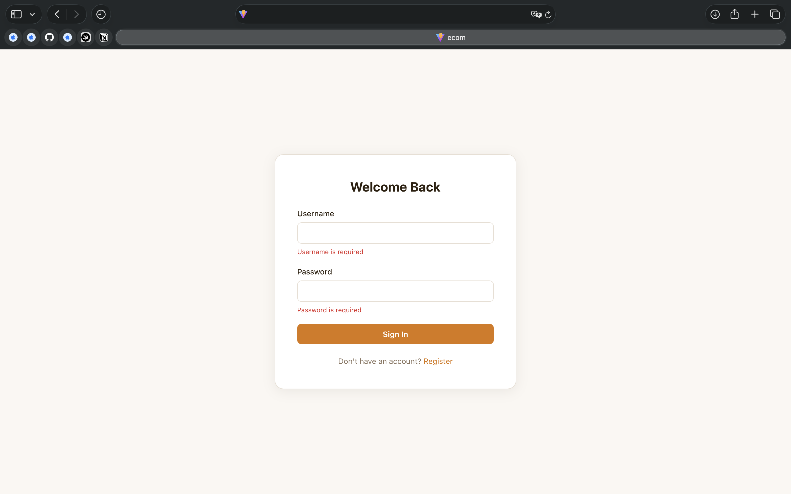
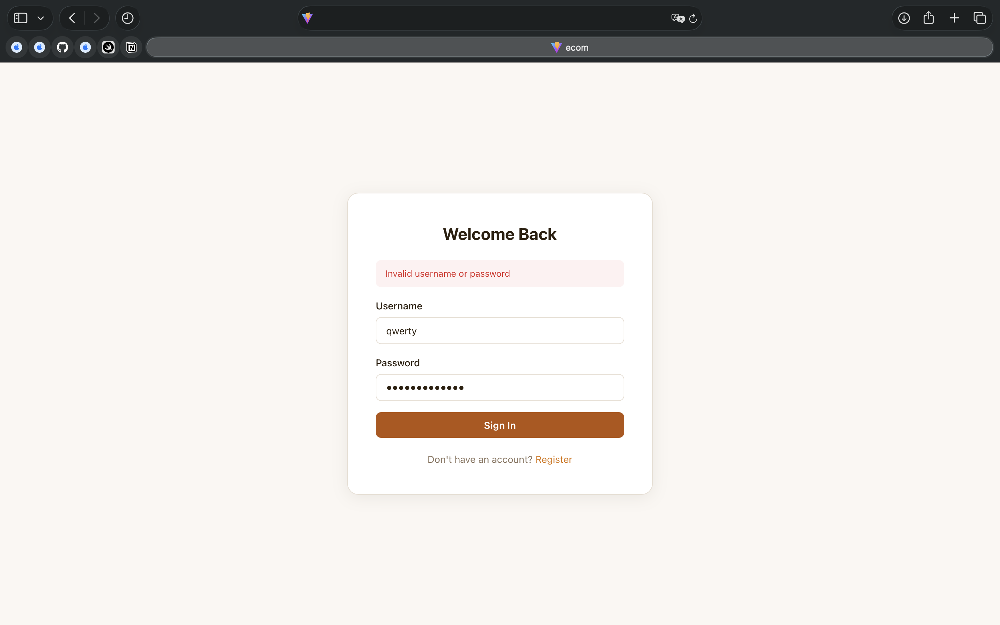
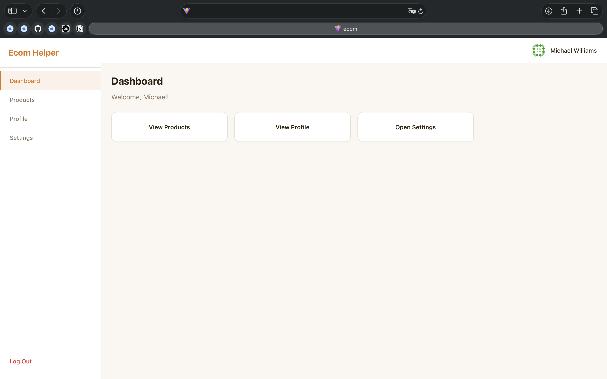
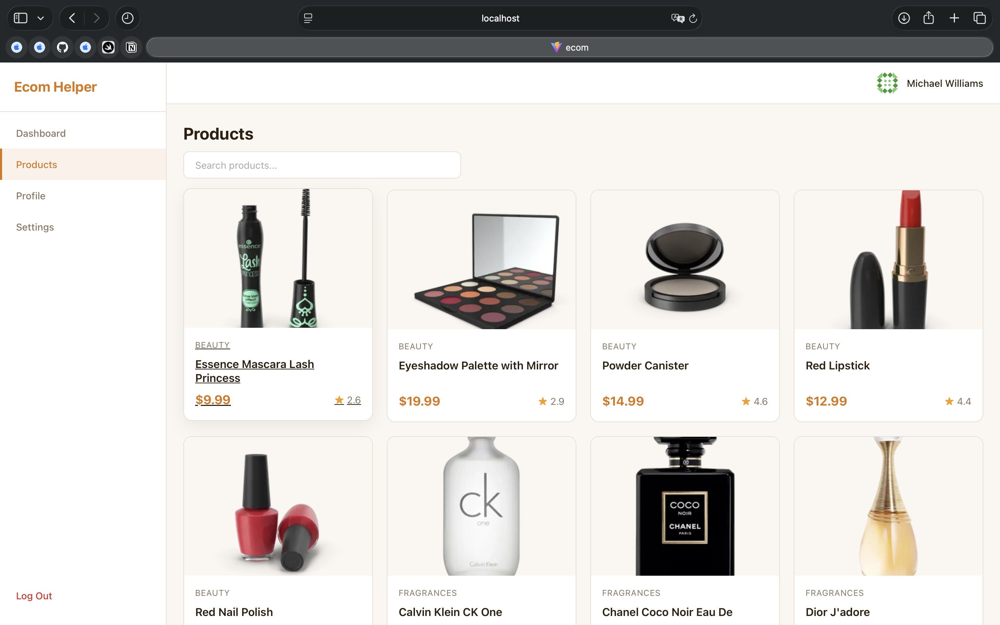
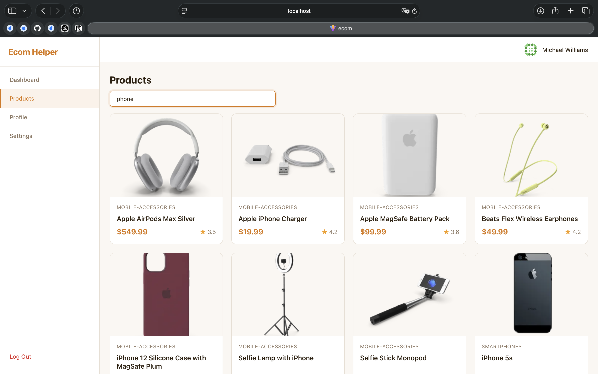
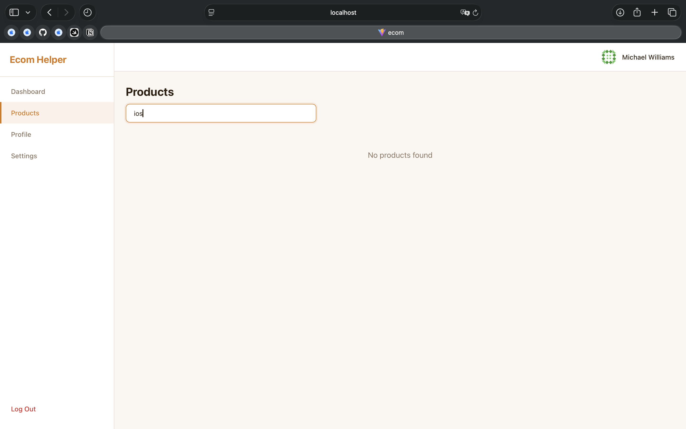
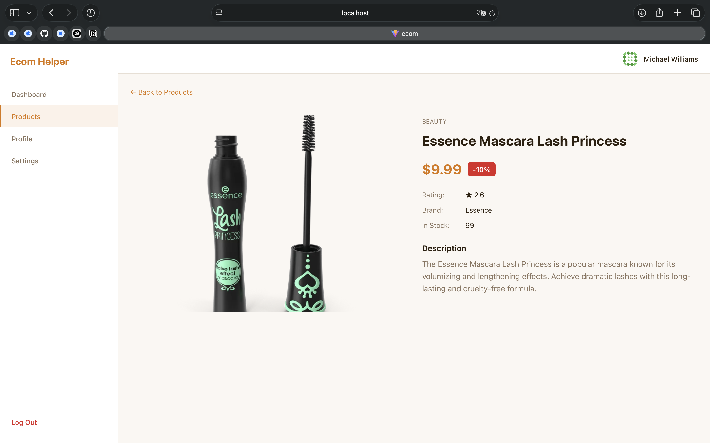
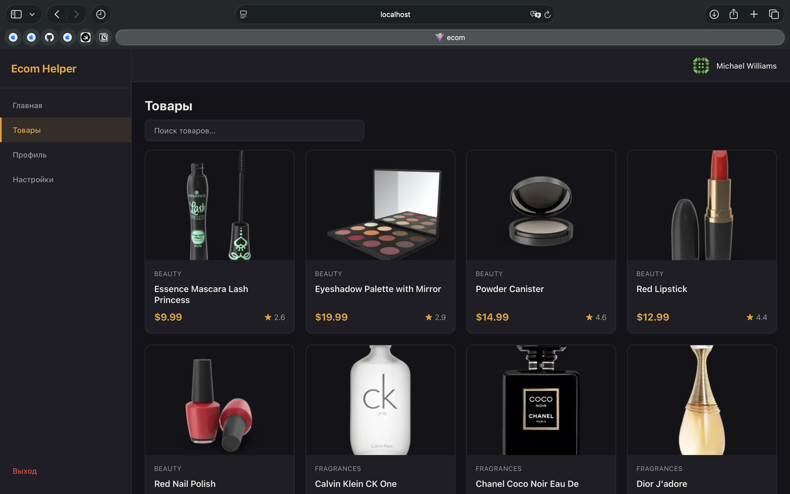
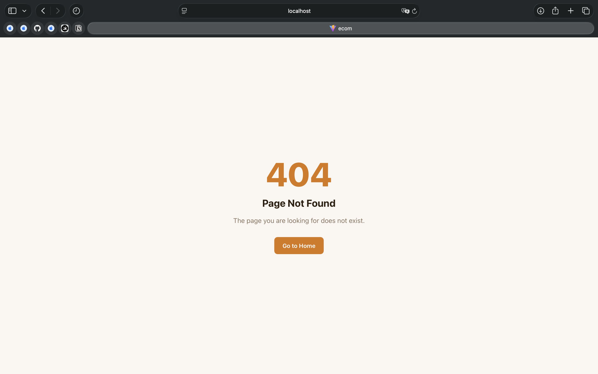

# HW3 — E-commerce Admin Panel

**ФИО:** Чёрный Алексей Владимирович

## Описание

SPA административная панель для e-commerce системы с полным пользовательским циклом: авторизация, работа с каталогом продуктов, управление настройками интерфейса.

**Технологический стек:** React 19, TypeScript, Redux Toolkit, RTK Query, React Router v7, i18next.

**Backend API:** [DummyJSON](https://dummyjson.com/docs)

## Инструкция по запуску

```bash
# Установка зависимостей
npm install

# Запуск в режиме разработки
npm run dev

# Production сборка
npm run build
```

### Тестовые учетные данные (или другие доступные через [DummyJSON](https://dummyjson.com/users))

- **Username:** `emilys`
- **Password:** `emilyspass`

## Архитектура

Проект реализован в соответствии с **Feature Sliced Design (FSD)**:

```
src/
  app/           — Инициализация приложения (store, router, providers)
  pages/         — Страницы приложения (lazy loading)
  widgets/       — Составные UI-блоки (Layout, Header, Sidebar)
  features/      — Бизнес-фичи (auth, products, settings)
  entities/      — Бизнес-сущности (user, product — типы)
  shared/        — Переиспользуемый код (API, i18n, UI-компоненты, конфиг)
```

### Ключевые решения

- **RTK Query** — все API-запросы через `createApi` с кэшированием и тегами
- **Auth** — токен хранится в localStorage, автоматическая инициализация при перезагрузке через `GET /auth/me`
- **Protected Routes** — `ProtectedRoute` / `PublicRoute` компоненты с редиректами
- **Lazy Loading** — все страницы загружаются через `React.lazy` + `Suspense`
- **i18n** — `i18next` с JSON-файлами переводов (ru/en), переключение без перезагрузки
- **Theming** — CSS Custom Properties с `data-theme` атрибутом для light/dark
- **Settings Persist** — настройки (язык, тема, размер страницы) сохраняются в localStorage через Redux
- **Error Boundary** — обработка ошибок рендеринга на уровне приложения
- **Мемоизация** — `memo()` на UI-компонентах, `useCallback` для обработчиков
- **Debounced Search** — поиск товаров с задержкой 400мс

### Маршруты

| Путь | Тип | Описание |
|------|-----|----------|
| `/login` | Публичный | Страница авторизации |
| `/register` | Публичный | Страница регистрации (заглушка) |
| `/` | Приватный | Dashboard |
| `/products` | Приватный | Список товаров с поиском и пагинацией |
| `/products/:id` | Приватный | Детальная страница товара |
| `/profile` | Приватный | Профиль пользователя |
| `/settings` | Приватный | Настройки (язык, тема, размер страницы) |
| `/logout` | Приватный | Выход из системы |
| `*` | — | Страница 404 |

### Скриншоты

**Авторизация — валидация полей:**



**Авторизация — неверные данные:**



**Dashboard:**



**Список товаров:**



**Поиск товаров:**



**Поиск — ничего не найдено:**



**Детальная страница товара:**



**Тёмная тема + русский язык:**



**Страница 404:**


